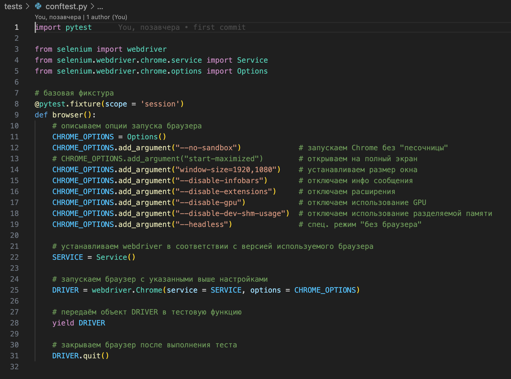
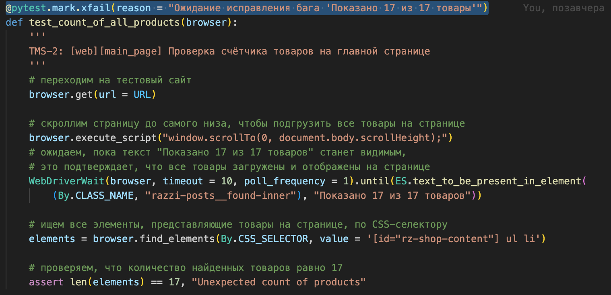
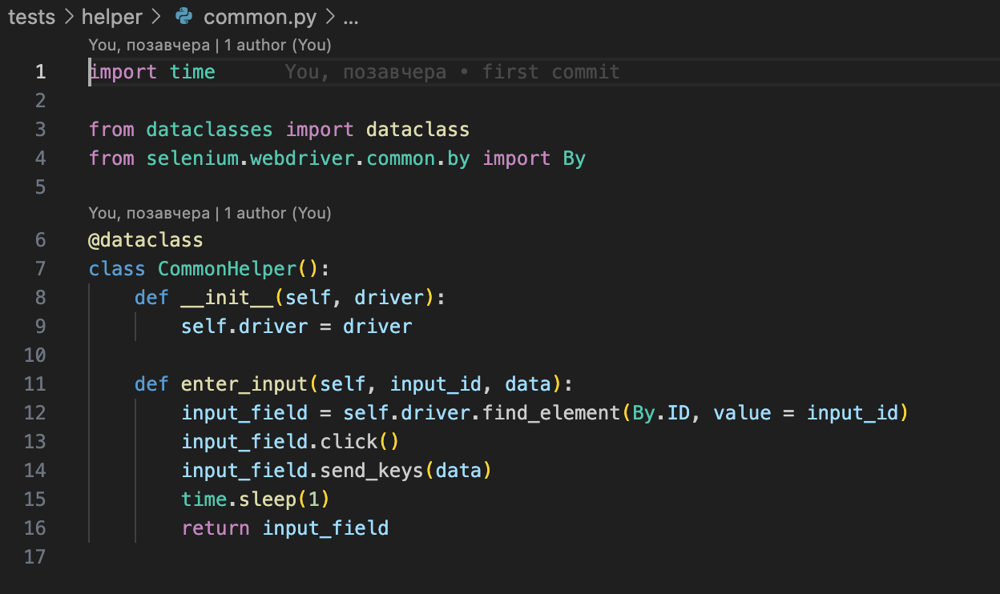
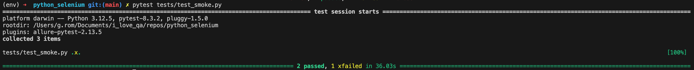

<h2>UI Автотесты на Python с применением фреймворка Pytest и Selenium</h2>

> **Статус проекта:**
> Публичный проект: https://test-shop.qa.studio/
> 
> 🟢 Поддерживается (активный) 

## Описание проекта и задачи
Автоматизировать часть проверок регресса с помощью Selenium

## Тест-кейсы, которые автоматизировали
* Проверка SKU товара "ДИВВИНА Журнальный столик"
* Проверка счётчика товаров на главной странице
* Проверка пути пользователя от входа на сайт до успешной покупки товара

## Детали реализации

1. Опции браузера вынесены в отдельную фикстуру `confest.py`


2. Один из тестов помечен `@pytest.mark.xfail` до исправления бага


3. Применение `dataclass` для заполнения инпутов при оформлении заказа


## Локальный запуск тестов (из терминала)
1. Скачать проект
2. Перейти через терминал в директорию проекта
3. Выполнить команды:

Создаём виртуальное окружение внутри папки проекта.
Далее команды для MacOS (для windows инуструкция [есть вот тут](https://realpython.com/python-virtual-environments-a-primer/#create-it))

``` markdown
python3 -m venv venv
```

``` markdown
source venv/bin/activate
```

4. Устанавливаем фреймворки

``` markdown
python3 -m pip3 install selenium
```

``` markdown
python3 -m pip3 install pytest
```

5. Запускаем
``` markdown
pytest tests/test_smoke.py
```

## Ожидаемый результат
Получаем отчет о прохождении тестов.


## Автор

 Роман Гранд ([@r_grand](https://t.me/r_grand))